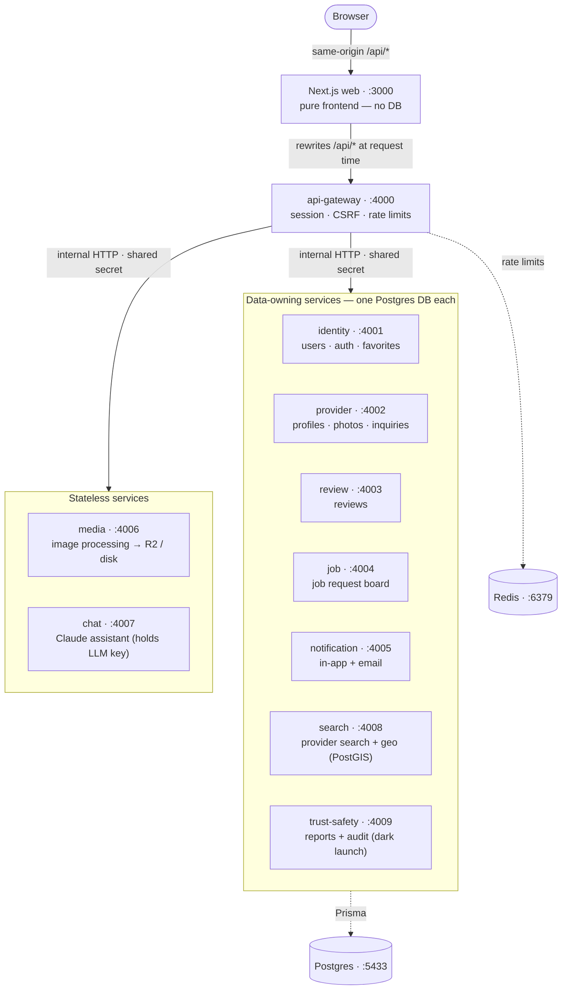

# Baas.lk

A service marketplace for Sri Lanka connecting customers with local professionals — mechanics, electricians, plumbers, garden designers and more. "Baas" (බාස්) is the Sinhala word for a skilled tradesman. Professionals build a public profile with work photos, social links, contact numbers and rates; customers browse, filter by district/category, send inquiries, leave reviews, and post job requests that matching professionals respond to. No payments happen on the platform — customers deal with professionals directly.

The customer-facing UI is bilingual — an EN/සිං toggle in the navbar switches between English and Sinhala (cookie-based, translations in `src/lib/i18n.ts`).

## Architecture

The marketplace is built as **ten Hono services — an API gateway fronting nine backend microservices — with a Next.js 16 web app as a pure frontend**, all backed by Postgres and Redis. The web app never touches a database — it rewrites `/api/*` to the gateway, which verifies the JWT session cookie, enforces CSRF + rate limits, and fans requests out to the backend services over internal HTTP secured by a shared secret. The seven data-owning services (identity, provider, review, job, notification, search, trust-safety) each own their own Postgres database, and Redis backs the gateway's distributed rate limiter and the notification email queue. Full details in [docs/ARCHITECTURE.md](docs/ARCHITECTURE.md). Narrative team documentation (onboarding, workflow, operations) is published to GitBook directly from this repo's [docs/](docs/) tree (Git Sync via `.gitbook.yaml` + `docs/SUMMARY.md`).



- The seven data-owning services (identity, provider, review, job, notification, search, trust-safety) each own a Postgres database; media and chat are stateless. search_db is a derived, rebuildable index (PostGIS) over provider data. Cross-service data flows over internal HTTP with a shared secret.
- The gateway verifies the JWT session cookie, enforces CSRF + distributed (Redis-backed) rate limits, and forwards identity headers.
- This repo is the **canonical monorepo**. Every service under `services/` is also mirrored to its own repo in the `luminary-dev` org (`npm run sync:repos`), where it builds, tests and deploys standalone.

**Stack** — Next.js 16 (App Router) + React 19 + Tailwind CSS 4 on the frontend; Hono + Prisma 7 (Postgres) + zod per service; Redis for rate limiting; JWT sessions in httpOnly cookies (`jose` + `bcryptjs`).

## Getting started

Prereqs: Node 24, Docker.

The Docker launchers in [`scripts/run/`](scripts/run/README.md) bring the stack
up in one command and **seed + reindex on first run** — no manual `db:seed` loop
or search-reindex call needed:

```bash
./scripts/run/app.sh          # all 10 services + web + infra, seeded → http://localhost:3000
./scripts/run/everything.sh   # the above + observability (Grafana :3001, Prometheus, Loki, Tempo, …)
./scripts/run/frontend.sh     # only the Next.js web UI
./scripts/run/backend.sh <service>   # one backend service + its DB (e.g. provider, api-gateway)
./scripts/run/seed.sh         # (re)seed demo data + rebuild the search index (idempotent; --force reseeds)
./scripts/run/stop.sh         # stop, keep data   (--wipe also deletes the DB volume)
```

Prefer running the app on the host? `npm run setup` installs everything, writes
the `.env` files, starts Postgres, migrates and seeds; `npm run dev:all` then
runs the gateway + all nine services + web (Ctrl-C stops everything). The host
path doesn't auto-reindex, so once the stack is up, populate the derived search
index once — it starts empty, so provider browse/search shows nothing until then:

```bash
npm run setup && npm run dev:all
curl -sS -X POST -H "x-internal-secret: ${INTERNAL_API_SECRET:-dev-internal-secret}" \
  http://localhost:4008/internal/search/reindex
```

Open http://localhost:3000. Ports: web `:3000`, gateway `:4000`, backend
services `:4001`–`:4009`; Postgres on host port **5433** (5432 is often taken by
a local install), Redis internal to the compose network. Verify a running,
seeded stack end to end:

```bash
npm run e2e         # scripts/e2e-smoke.sh — expect "…, 0 failed"
```

**Local data is disposable** — the seeds are dummy data only, not preserved
between runs. `./scripts/run/stop.sh --wipe` (or `scripts/dev-reset.sh` on the
host path) tears down the volumes so the next launch starts clean and reseeds.

### Seeded accounts (password: `password123`)

> Demo accounts are for **local development only** — the seed refuses to run
> with `NODE_ENV=production` unless you explicitly set `SEED_DEMO_DATA=true`
> (the production compose images run as `NODE_ENV=production`, so seeding there
> is a deliberate opt-in). Bootstrap a real admin with `npm run create-admin`
> in `services/identity-service` (takes `--email`/`--password` flags or
> `ADMIN_EMAIL`/`ADMIN_PASSWORD` env vars).

| Role | Email | Notes |
| --- | --- | --- |
| Provider | `nuwan@example.com` | Mechanic, Colombo — has reviews + an inquiry |
| Provider | `kumari@example.com` | Garden designer, Kandy |
| Customer | `dilani@example.com` | Can leave reviews and post jobs |
| Admin | `admin@baas.lk` | Admin dashboard: verifications, suspensions, moderation |

## Features

**Customers** (account optional)
- Browse/search professionals by keyword, category and district, with sorting and pagination
- View profiles: bio, services & rates (LKR), work-photo gallery with lightbox, social links, reviews
- Send inquiries without an account; call/WhatsApp directly
- Ask the built-in Claude marketplace assistant to find providers and start inquiries in chat
- With a free account: leave star-rated reviews (with photos), save favorites, post job requests

**Professionals** (account required)
- 4-step registration: account → profile → contact & socials → services & rates
- Dashboard: stats, edit profile & availability, manage services, upload photos, manage inquiries
- Job board: open jobs matching their category & district, one response per job
- Identity verification (NIC/business docs) reviewed by admins for a verified badge

**Admins** (tiered roles)
- Admin panel with two role tiers (**SUPPORT** read + report resolve/dismiss; **ADMIN** full access) gating what each admin can do, enforced in the web app and the backend services
- Moderation: identity-verification review, provider suspension, and an abuse-report queue across providers, photos and reviews
- User & job management, bulk actions, quality-score views, on-demand auto-flagging, content restore, and in-app notification badges
- Every privileged action is written to an audit log; admins can impersonate users for support (see [docs/ADMIN.md](docs/ADMIN.md) and [docs/AUTHZ.md](docs/AUTHZ.md))

**Platform**
- Bilingual EN/සිං UI (cookie-based toggle) with light/dark themes (see [docs/DESIGN.md](docs/DESIGN.md))
- Image uploads processed with sharp (re-encode + EXIF strip) and served from Cloudflare R2, or local disk in dev

## Project layout

```
src/                     Next.js app (pages, components, i18n) — no database access
services/
  api-gateway/           public entry: routing, session verify, CSRF, rate limits
  identity-service/      users, sessions, tokens, favorites        (identity_db)
  provider-service/      providers, services, photos, inquiries    (provider_db)
  review-service/        reviews, review photos                    (review_db)
  job-service/           job requests + responses                  (job_db)
  notification-service/  in-app notifications + email (Resend)     (notification_db)
  media-service/         image processing (sharp) + file storage   (R2 / local disk)
  chat-service/          Claude marketplace assistant (holds LLM key) (stateless)
  search-service/        provider search + geo discovery (PostGIS)  (search_db)
  trust-safety-service/  unified reports + moderation audit (dark)  (trust_safety_db)
scripts/                 setup, dev-all, e2e-smoke, sync-service-repos
scripts/run/             Docker launchers: app, everything, frontend, backend, seed, stop
docs/ARCHITECTURE.md     service contracts, conventions, env vars
docker-compose.yml       Postgres + all services + web
```

Each service is self-contained (own `package.json`, lockfile, Prisma schema, Dockerfile, CI workflow, tests): `npm run typecheck && npm test && npm run build` works in any of them in isolation.

## Production notes

- Set a strong shared `AUTH_SECRET` (identity signs; gateway + web verify) and a strong `INTERNAL_API_SECRET` (all services + gateway); never expose service ports publicly — only the gateway. Secrets live in the environment, never in the repo (see [SECURITY.md](SECURITY.md)).
- Uploads use Cloudflare R2 (S3-compatible, private bucket) when the four `R2_*` vars are set; otherwise local disk served via the gateway (`/api/files/*`) — fine for a single node, use R2 when scaling out.
- Rate limits are Redis-backed and shared across gateway instances (`REDIS_URL`), with a per-instance in-memory fallback when Redis is unavailable (see [docs/RATE_LIMITING.md](docs/RATE_LIMITING.md)).
- **Email (password reset & verification) is NOT delivering to real users yet** — it needs a verified sending domain + `RESEND_API_KEY` on notification-service. See [docs/EMAIL_SETUP.md](docs/EMAIL_SETUP.md).
- Releases follow a `dev → prod` branch model: changes land on `dev`, and a `dev → prod` PR cuts a tagged release; production runs pre-built GHCR images (see [docs/DEPLOYMENT.md](docs/DEPLOYMENT.md) and [docs/OPERATIONS.md](docs/OPERATIONS.md)).

## Contributing

Read [CONTRIBUTING.md](CONTRIBUTING.md) before your first change — it covers local
setup, the branch/PR workflow, Conventional Commits, and the merge rules. The full
engineering contract (for humans and AI assistants alike) is in [CLAUDE.md](CLAUDE.md).

## Documentation

The monorepo `docs/` folder is the canonical technical + process reference — the team's GitBook space is published directly from it (Git Sync via `.gitbook.yaml` + `docs/SUMMARY.md`), so there is no separate docs repo.

- [docs/ARCHITECTURE.md](docs/ARCHITECTURE.md) — service contracts, conventions, env vars, data flow
- [docs/FEATURES.md](docs/FEATURES.md) — product feature reference, per surface
- [docs/AUTHZ.md](docs/AUTHZ.md) — authentication, sessions and the role/permission model
- [docs/ADMIN.md](docs/ADMIN.md) — admin panel: tiered roles, audit log, moderation, impersonation
- [SECURITY.md](SECURITY.md) — security model, secrets, and service hardening
- [docs/RATE_LIMITING.md](docs/RATE_LIMITING.md) — the Redis-backed distributed rate limiter
- [docs/DESIGN.md](docs/DESIGN.md) — the design system, theming and i18n
- [docs/DEPLOYMENT.md](docs/DEPLOYMENT.md) — the `dev → prod` release flow and production topology
- [docs/OPERATIONS.md](docs/OPERATIONS.md) — running, monitoring and troubleshooting the stack
- [docs/BACKUPS.md](docs/BACKUPS.md) — database backup and restore
- [docs/EMAIL_SETUP.md](docs/EMAIL_SETUP.md) — configuring Resend for real email delivery
- [docs/TESTING.md](docs/TESTING.md) — the test layers, CI matrix, coverage and known gaps
